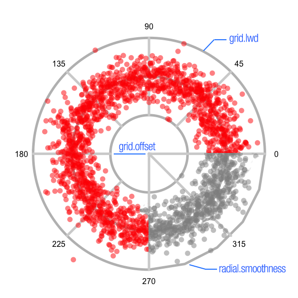

# RadialPlot extension to plotrix

Simple extension to plotrix's `polar.plot`.

Written and tested using `plotrix v3.7-4`.

The `polar.plot` function now accepts 3 more parameters:

- `grid.lwd` -> changes the thickness of the grid lines
- `grid.smoothness` -> changes the 'roundness' of the radial grid lines (defaults to 0.04, but 0.01 is a bit smoother 😉)
- `radial.offset` -> changes the inner offset of the grid lines

See `test.R` for usage.

See https://cran.r-project.org/web/packages/plotrix/index.html for package info.

